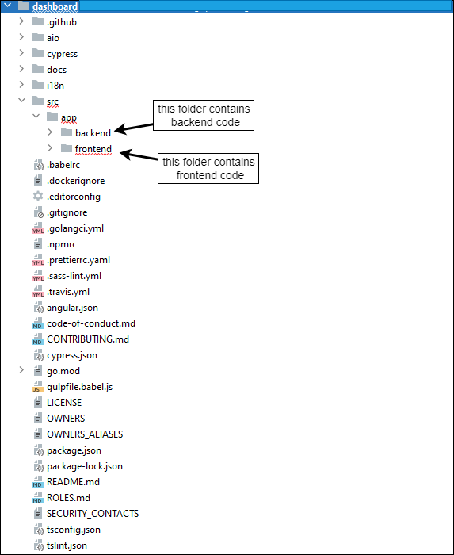
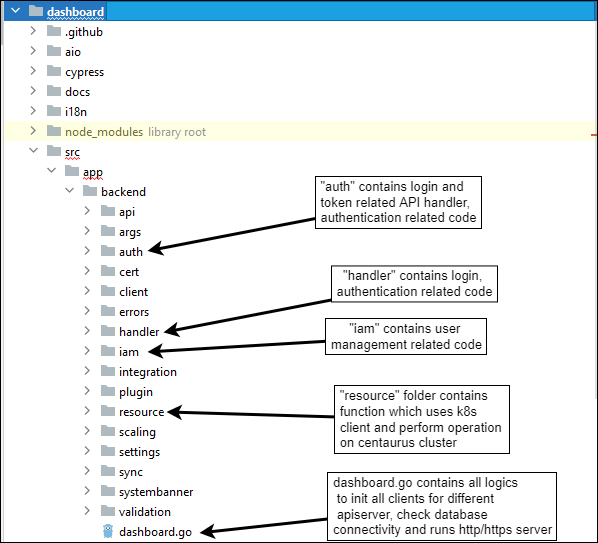
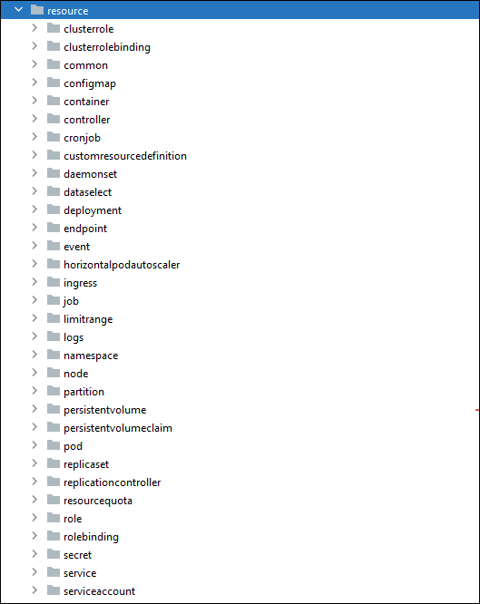
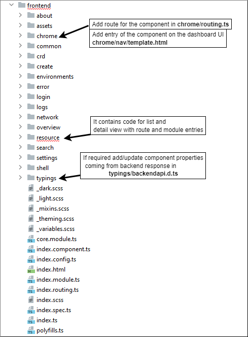
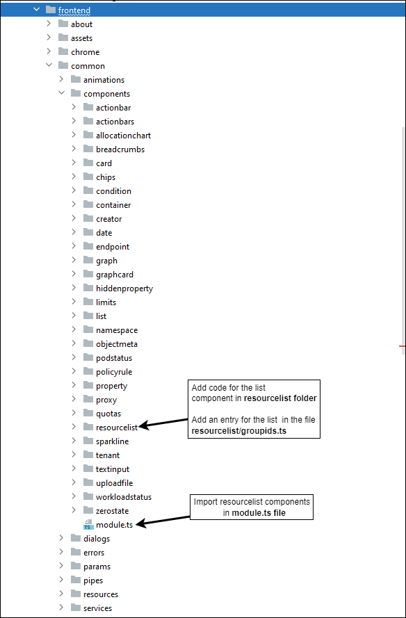
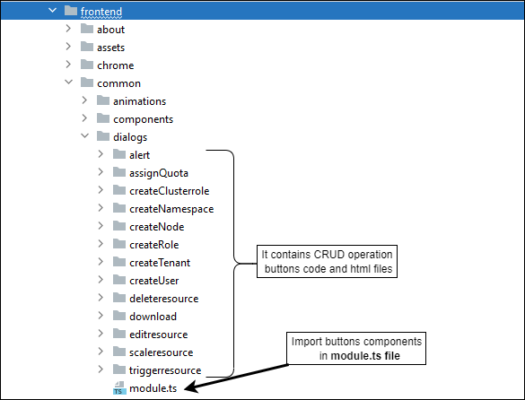
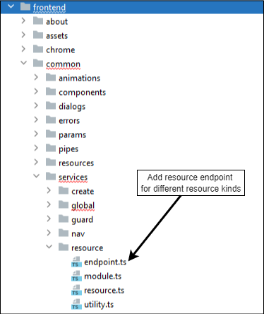

# Centaurus dashboard architecture and workflow

### Centaurus dashboard service architecture
Centaurus dashboard has frontend(angular8), backend(golang) and database (PostgreSQL). backend service can send request to specific partition's api-server of Centaurus cluster (tested for 2TP and 2RP centaurus cluster).

### Tenant management for 2TP Centaurus Cluster
For 2 Tenant partition, all tenants' name starting with alphabet **a** to **m**, will get created in **Tenant partition-1(TP-1)** and all tenants's name starting with **n** to **z**, will get created in **Tenant partion-2(TP-2)**

### Overall code architecture

### Backend code structure ( details of files which were modified)

#### Following files contains golang code for CRUD operation of Centaurus cluster resources

### Frontend code structure (details of files which were modified)

#### Code to list the resources (frontend code files)

#### Code for dialogs of CRUD operation (frontend code files)

#### Code for mapping endpoints for resource kinds

